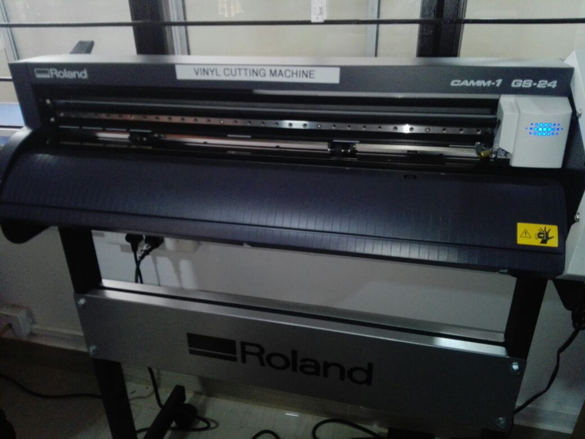

## Welcome to My Fab Experience

A fab lab (fabrication laboratory) is a small-scale workshop offering (personal) digital fabrication.A fab lab is typically equipped with an array of flexible computer-controlled tools that cover several different length scales and various materials, with the aim to make “almost anything”. This includes technology-enabled products generally perceived as limited to mass production.

### Syllabus

- Day 1 : Introduction to Fablab

- Day 2 : Github Pages and Documentation

- Day 3: Electronics Production and CNC

- Day 4 : Vinyl Cutting

- Day 5 : Screen Printing

- Day 6 : 3D Printing

- Day 7 : Laser Cutting,Moulding and Casting

 ### 3D Printer
 
   - 
   
   - 

   - 

### Vinyl Cutter
 
   - 
   
   - 
   
   - 

### Electronics Production

   - 
   
   - 
   
   - 
   
   - 
   
   - 
   
   - 

## About Me

 Pursuing Bachelor of technology in Electronics and Communication Engineering from MES College of Engineering, Kuttippuram.

